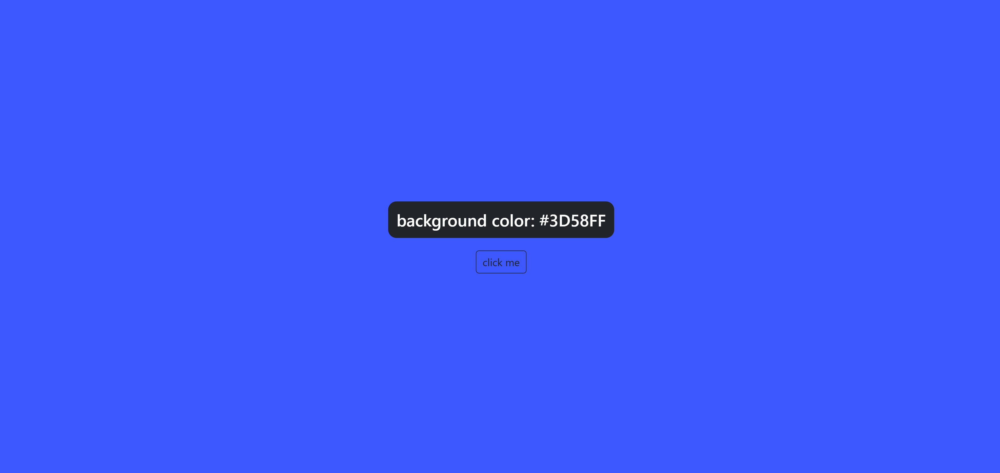
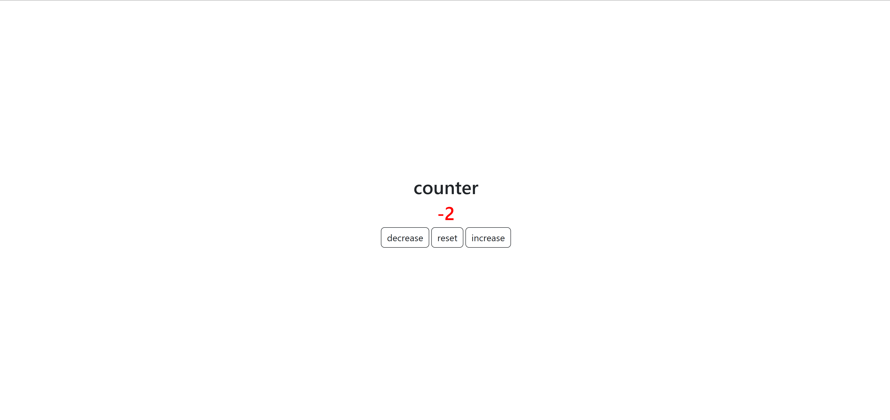
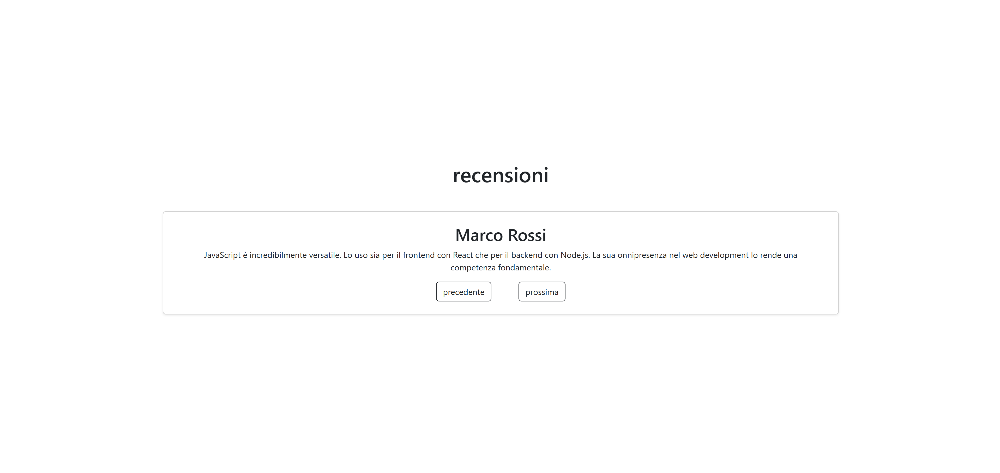
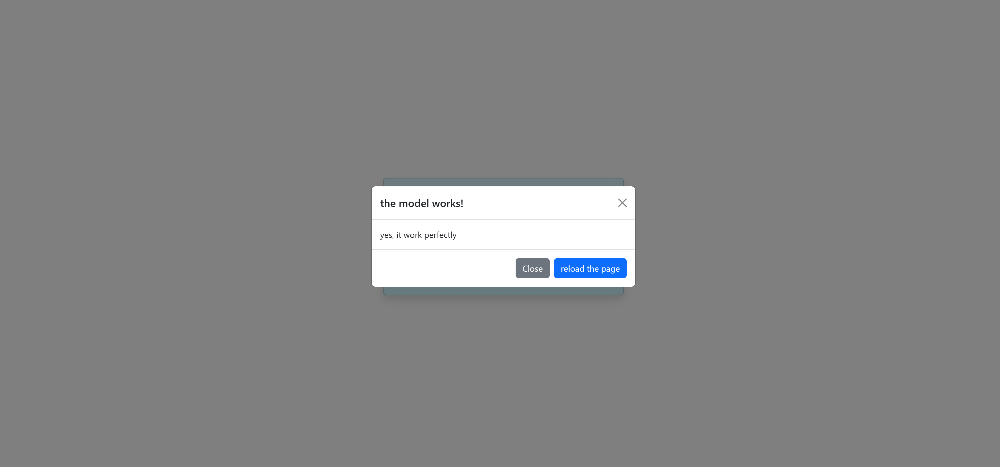
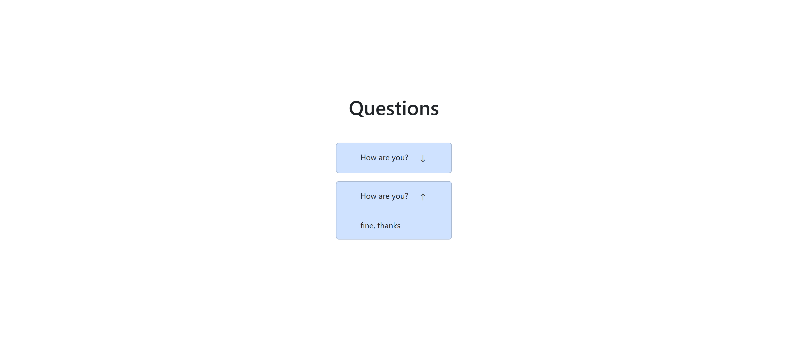
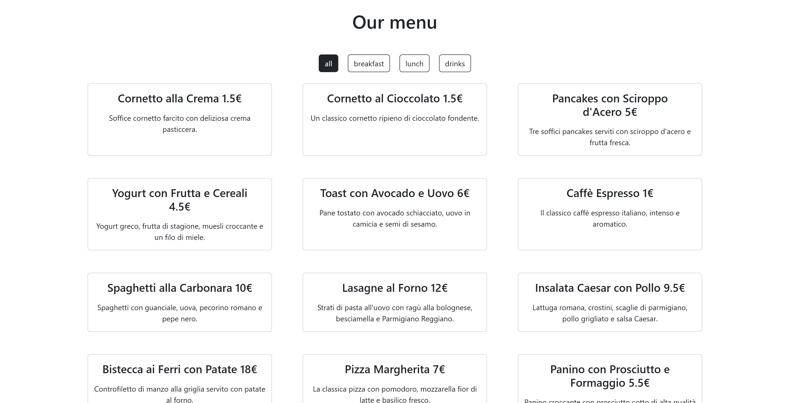

## Questa cartella è dedicata ai seguenti esercizi di javascript:

- ### color-flipper:

  pagina con un tasto che permetta di modificare in maniera randomica il colore di sfondo della pagina.
  

- ### counter:

  pagina con un counter che può essere aumentato, diminuito o resettato a zero. Se il numero scende sotto lo zero viene visualizzato in rosso.
  

- ### review:

  pagina che visualizza una recensione. Si può passare da una recensione all altra tramite i tasti.
  

- ### modal:

  pagina in cui testare i modal di bootstrap
  

- ### dropdown:

  semplice test con 2 domande con un dropdown ciascuno per visualizzare la risposta. Quando si apre una risposta, l'altra si chiude automaticamente.
  

- ### menu filter:
  visualizzazione di un menu fittizio, con tasti per filtrare i risultati. il tasto selezionato rimane evidenziato.
  
